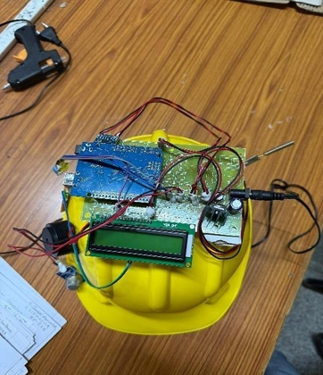
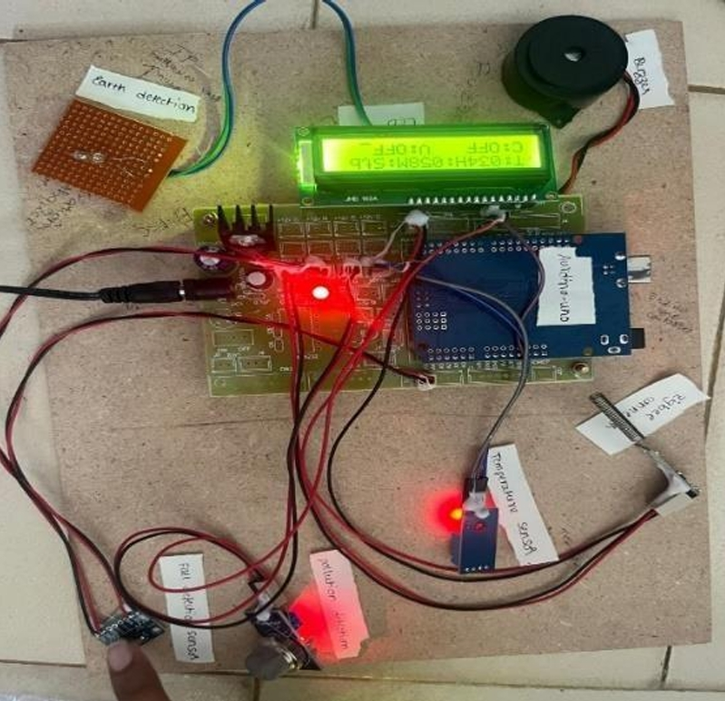

# Smart Helmet for Coal Mine Workers
## Overview
This project is an IoT-based smart safety helmet designed for coal mine workers.  
The system helps improve worker safety by detecting harmful gases, smoke, and fire hazards inside coal mines.
It also uses GSM and GPS technology to send emergency alerts and location information during dangerous situations.
This project was developed as part of an academic project focused on improving safety for coal mine workers using IoT technology.
During this project, we learned about sensor integration, GSM communication, GPS tracking, and embedded systems.
## Features
- Gas detection system
- Smoke detection
- Fire detection
- GSM emergency alert
- GPS location tracking
- Worker safety monitoring
## Technologies Used
- Arduino / Embedded System
- GSM Module
- GPS Module
- MQ Gas Sensor
- Flame Sensor
- IoT Technology
## Project Files
- Circuit Diagram
- PPT Presentation
- Thesis Documentation
- Helmet Images
## Applications
- Coal mines
- Underground worker safety
- Industrial safety monitoring
- Hazard detection systems
## Future Improvements
- Mobile application integration
- Cloud monitoring system
- Real-time IoT dashboard
- AI-based safety prediction
## Project Images
### Helmet Design

### Circuit Diagram

## Conclusion
The Smart Helmet project helps improve safety for coal mine workers by providing real-time monitoring and emergency alert systems.  
This system can reduce accidents and improve communication during dangerous situations in mines.
## Author
Srinivas
